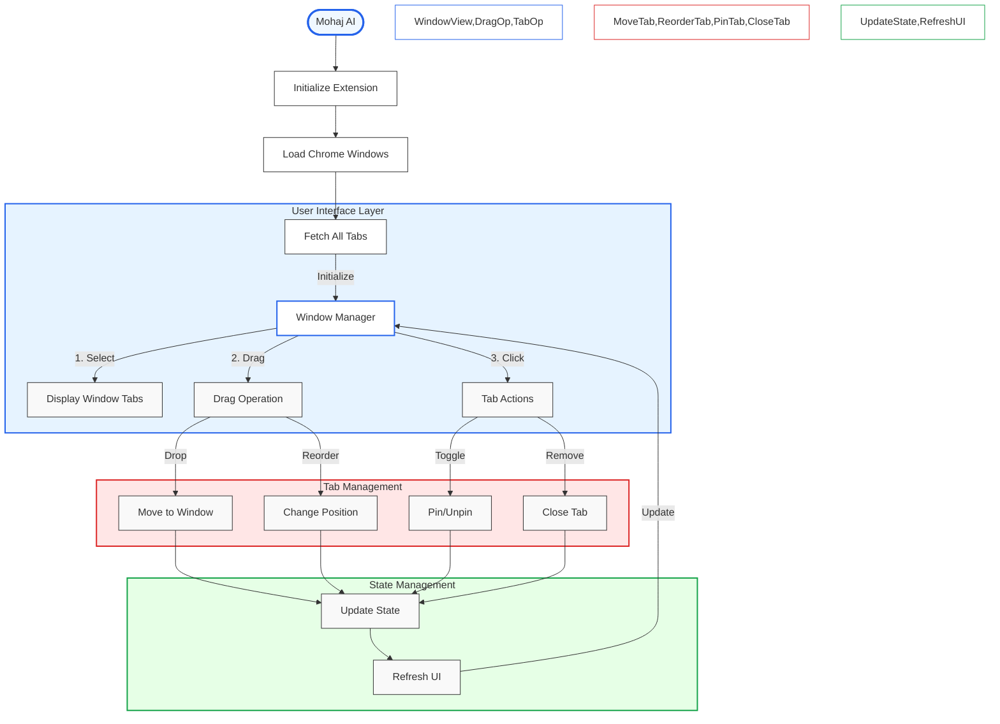

# Mohaj AI - Smart Tab Management System

## Main Process Flow



## Features

- Efficient window and tab management
- Drag and drop tab organization
- Multi-window support
- Tab pinning and reordering
- Visual tab organization
- Intuitive user interface

## Installation

1. Clone the Mohaj AI repository:
```bash
git clone https://github.com/yourusername/mohaj-ai.git
cd mohaj-ai
```

2. Install dependencies:
```bash
npm install
```

3. Build the extension:
```bash
npm run build
```

4. Load the extension in Chrome:
   - Open Chrome and navigate to `chrome://extensions/`
   - Enable "Developer mode" in the top right
   - Click "Load unpacked" and select the `dist` directory from this project

## Development

- Run the development build with watch mode:
```bash
npm run watch
```

- The extension will automatically rebuild when you make changes
- Refresh the extension in Chrome to see your changes

## Usage

1. Click the Mohaj AI icon in your Chrome toolbar
2. Select a window from the dropdown to view its tabs
3. Drag and drop tabs between windows using the drop zones
4. Use the pin/unpin and close buttons to manage tabs
5. Create new windows as needed

## Technologies Used

- React
- TypeScript
- Chrome Extensions API
- React DnD
- Tailwind CSS

## License

MIT