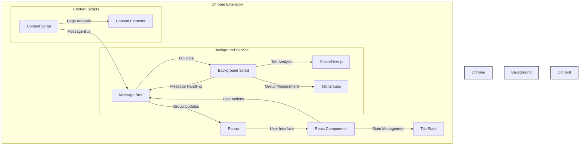
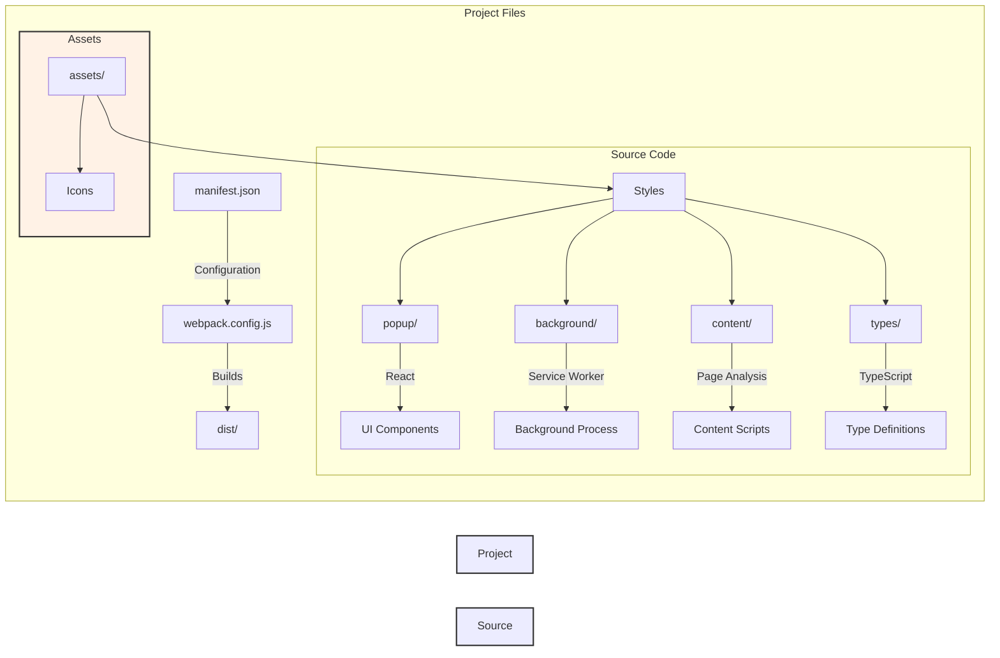

# AI-Powered Tab Manager & Organizer

A Chrome extension that uses AI to intelligently organize and manage your browser tabs.

## Project Architecture



## Features

- Automatic tab grouping using AI/NLP
- Content summarization for tab groups
- Session management
- Customizable grouping options
- Visual tab organization

## Installation

1. Clone this repository:
```bash
git clone https://github.com/yourusername/ai-tab-manager.git
cd ai-tab-manager
```

2. Install dependencies:
```bash
npm install
```

3. Build the extension:
```bash
npm run build
```

4. Load the extension in Chrome:
   - Open Chrome and navigate to `chrome://extensions/`
   - Enable "Developer mode" in the top right
   - Click "Load unpacked" and select the `dist` directory from this project

## Development

- Run the development build with watch mode:
```bash
npm run watch
```

- The extension will automatically rebuild when you make changes
- Refresh the extension in Chrome to see your changes

## Project Structure



## Usage

1. Click the extension icon in your Chrome toolbar
2. Click "Analyze Tabs" to automatically group your open tabs
3. View and manage your tab groups
4. Save sessions for later use
5. Customize grouping settings as needed

## Technologies Used

- React
- TypeScript
- TensorFlow.js
- Chrome Extensions API
- Tailwind CSS

## License

MIT 